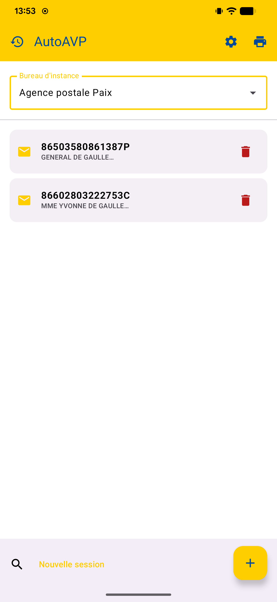
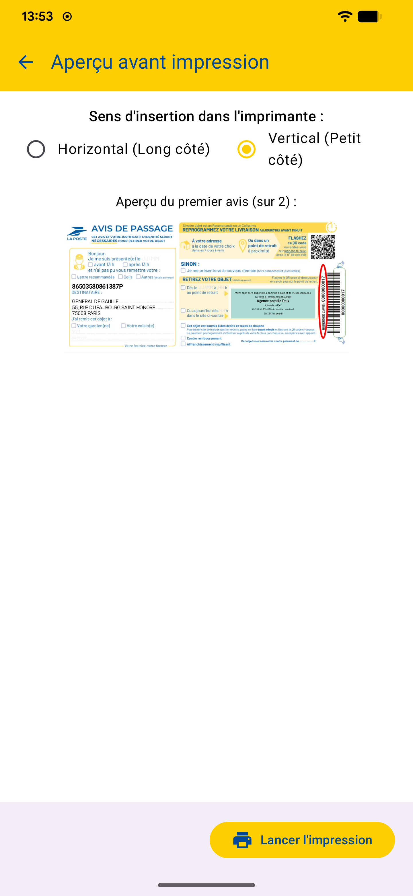
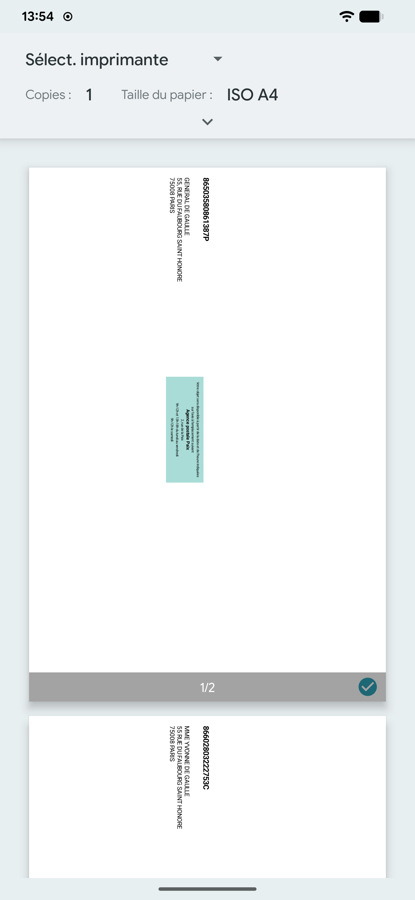
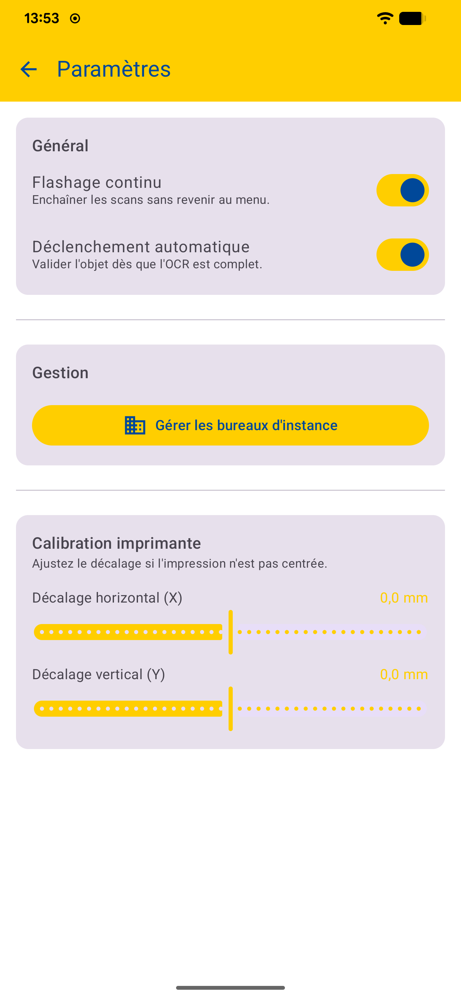
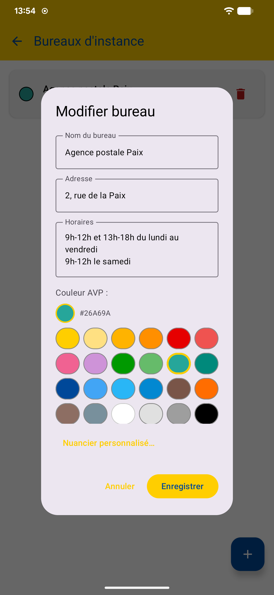

<p align="center">
  
</p>

<h1 align="center">AutoAVP</h1>

<p align="center">
  <strong>Automatisez la saisie et l'impression des Avis de Passage postaux</strong>
</p>

<p align="center">
  
  
  
</p>

---

AutoAVP est une application Android qui permet aux agents postaux de **scanner les codes-barres et DataMatrix** des courriers recommandés, d'en extraire automatiquement le numéro de suivi et l'adresse du destinataire par OCR, puis de **générer et imprimer les Avis de Passage** (AVP) correspondants, prêts à être déposés en boîte aux lettres.

## Fonctionnalités

- **Scan intelligent** — Lecture des codes-barres 1D et DataMatrix (Smartdata) via CameraX + ML Kit, avec calcul et vérification de la clé ISO 7064
- **OCR automatique** — Extraction de l'adresse destinataire directement depuis l'enveloppe
- **Mode continu** — Enchaînement des scans sans retour au menu, pour traiter une tournée complète en quelques minutes
- **Gestion multi-bureaux** — Configuration de plusieurs bureaux d'instance avec adresse, horaires et couleur AVP personnalisée
- **Aperçu avant impression** — Visualisation fidèle de l'AVP généré, avec choix de l'orientation d'insertion (horizontale / verticale)
- **Impression PDF** — Génération au format réglementaire avec calibration fine du décalage imprimante
- **Historique des sessions** — Consultation et reprise des sessions précédentes
- **Recherche** — Filtrage par numéro de suivi ou adresse

## Captures d'écran

<p align="center">
  
  &nbsp;&nbsp;
  
  &nbsp;&nbsp;
  
</p>

<p align="center">
  
  &nbsp;&nbsp;
  
  &nbsp;&nbsp;
  
</p>

## Installation

Téléchargez le fichier APK depuis la page [**Releases**](../../releases/latest) et installez-le sur votre appareil Android (version 9+).

> L'installation depuis des sources externes doit être autorisée dans les paramètres de votre appareil.

## Stack technique

| Composant | Technologie |
|---|---|
| UI | Jetpack Compose + Material 3 |
| Architecture | MVVM, Hilt (DI) |
| Base de données | Room |
| Caméra | CameraX |
| Reconnaissance | ML Kit (texte + codes-barres) |
| Impression | Android Print Framework / PDF |

## Compilation

```bash
git clone https://github.com/<user>/AutoAVP.git
cd AutoAVP
./gradlew assembleRelease
```

> Requiert le SDK Android 36 et JDK 17.

## Licence

Ce projet est distribué sous licence [MIT](LICENSE).
